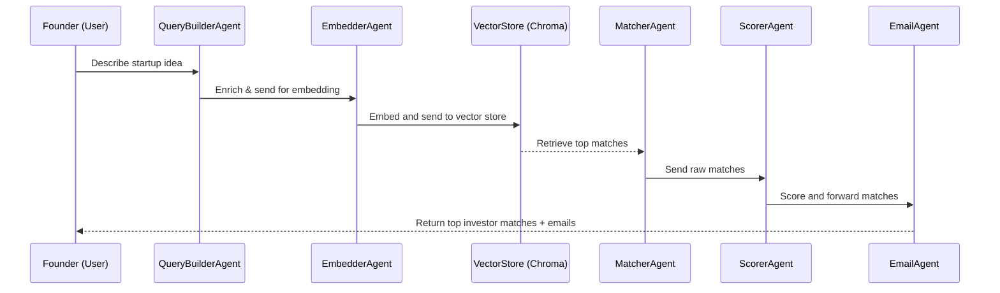

# Founder–Investor Matching Multi-Agent System 🚀💼

An intelligent multi-agent system that matches startup founders with the most suitable investors using LangGraph, LangChain, and Google Generative AI embeddings.


---

## 🧠 Core Architecture

```mermaid
graph TB
    UI[User Input (Startup Idea)]
    QB[Query Builder Agent]
    EMB[Google GenAI Embeddings]
    VS[Chroma Vector Store]
    MT[Matcher Agent]
    SC[Scorer Agent]
    EM[Email Generator Agent]
    RESP[Response Output]

    UI --> QB
    QB --> EMB
    EMB --> VS
    VS --> MT
    MT --> SC
    SC --> EM
    EM --> RESP
```

---

## 🔁 Query Flow Sequence



---

## 🧩 Agent Roles

| Agent            | Responsibility                                                         |
|------------------|-------------------------------------------------------------------------|
| `QueryBuilder`   | Enhances the user query using Gemini to produce a detailed pitch.       |
| `Embedder`       | Embeds the enriched query using `GoogleGenerativeAIEmbeddings`.         |
| `Matcher`        | Performs similarity search using Chroma vector DB.                      |
| `Scorer`         | Normalizes and formats scores for top investor matches.                 |
| `EmailGenerator` | (Optional) Generates personalized cold outreach emails.                 |

---

## 🔍 Example Output

```
Describe your startup idea: AI-powered personalized learning platform for university students.

🔍 Top Matching Investors:

Name: Sarah Chen
Score: 100.0%
Investment Range: $50000 - $250000
Sectors: HealthTech, EdTech, Sustainability
Stages: Pre-seed, Seed
Description: Impact-focused investments in founders addressing major societal challenges through technology. Early stage focus.
------------------------------------------------------------
...
```

---

## 🛠️ Technical Stack

- **LangGraph**: for multi-agent workflow management
- **LangChain**: LLM tools and embedding interfaces
- **Google Generative AI**: embedding & LLM query enrichment
- **ChromaDB**: vector store for investor profiles
- **Pandas**: CSV profile handling

---

## 🔧 Key Configurations

```python
EMBEDDING_MODEL = "models/embedding-001"
VECTOR_DB_DIR = "investor_chroma_db"
TOP_K = 5
```

---

## 📦 Requirements

```text
langchain==0.1.16
langgraph==0.0.30
langchain-google-genai==0.0.8
google-generativeai==0.4.1
google-auth==2.29.0
chromadb==0.4.24
pandas==2.2.2
python-dotenv==1.0.1
tqdm==4.66.2
scikit-learn==1.4.2
numpy==1.26.4
```

---

## 🚀 Getting Started

```bash
git clone https://github.com/yourusername/founder-investor-matcher
cd founder-investor-matcher
pip install -r requirements.txt
```

Create a `.env` file:
```env
GOOGLE_API_KEY=your-google-api-key
```

Run the app:
```bash
python run.py
```

---

## 📈 Performance Highlights

| Component         | Avg Time (s) | Notes                                      |
|------------------|--------------|--------------------------------------------|
| Query Embedding   | ~1.1s        | Using Google Generative AI                 |
| Vector Search     | ~0.5s        | ChromaDB similarity search                 |
| Query Rewriting   | ~2.0s        | via Gemini model                           |
| Score Computation | Instant      | Cosine normalization                       |

---

## 👤 Maintainer
**Aishwarya** – Built with 💡 using LangGraph & Google AI

---
Built with ❤️ by Aishwarya
